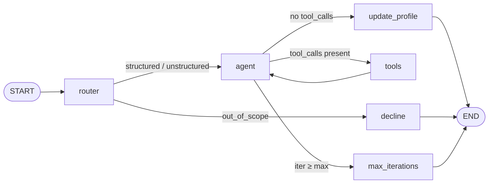

# Architecture

This document explains how the Customer Service Data Analyst Agent works
end-to-end. It is meant as a companion to the code in [`src/`](src/) — read
it once and you should be able to navigate any node in the graph.

---

## 1. Bird's-eye view

The agent is a **LangGraph state machine**. One question from the user
flows through the graph once and produces one final answer. The graph
is wrapped in a `SqliteSaver` checkpointer (Task 2a) so the message
history is restored on the next process run for the same `thread_id`.
After every final answer, an `update_profile` node refreshes a
per-user markdown profile (Task 2b).



Plain-text version (for terminals):

```
                   ┌────────┐
   START ────────▶ │ router │ ── classifies the question
                   └───┬────┘
                       │
        ┌──────────────┼────────────────┐
        │              │                │
   out_of_scope   structured     unstructured
        │              │                │
        ▼              ▼                ▼
   ┌─────────┐     ┌──────────────────────┐
   │ decline │     │        agent         │ ◀──┐
   └────┬────┘     │  (LLM with tools)    │    │
        │          └────┬─────────────┬───┘    │
        │   no calls    │             │ calls  │
        ▼               ▼             ▼        │
       END   ┌──────────────────┐ ┌─────┐      │
             │  update_profile  │ │tools│──────┘
             └────────┬─────────┘ └─────┘
                      ▼
                     END
                      ▲
                      │ iter ≥ max
                ┌──────────────────┐
                │  max_iterations  │
                └──────────────────┘
```

The three query paths the assignment cares about each take a different
route through this graph:

| Query type | Path |
|---|---|
| **structured** (e.g. *"how many refund requests?"*) | router → agent ↔ tools → END |
| **unstructured** (e.g. *"summarize FEEDBACK"*) | router → agent ↔ tools → END *(tools used to fetch raw rows for the LLM to summarize)* |
| **out-of-scope** (e.g. *"who is the president of France?"*) | router → decline → END *(zero tool calls, zero LLM reasoning on the content)* |

---

## 2. Shared state

Every node reads and writes the same `AgentState`
([src/agent.py](src/agent.py)):

```python
class AgentState(TypedDict):
    messages: Annotated[list[BaseMessage], add_messages]  # conversation
    classification: Optional[str]   # "structured" | "unstructured" | "out_of_scope"
    route_reason: Optional[str]     # one-line justification, for logging
    iterations: int                 # ReAct loop counter
    user_id: Optional[str]          # selects the per-user profile file
```

- `messages` is the canonical LangGraph message channel. The reducer
  `add_messages` *appends* new messages rather than replacing the list,
  so every node can return just its delta. With the checkpointer
  enabled, this list is also persisted to disk between runs.
- `iterations` is incremented on each `agent` step. It is the basis for
  the max-iterations fallback (see §6). The router resets it to 0 at
  the start of every new question so the counter is per-turn, not
  per-session.
- `classification` is set once by the router and read by the conditional
  edge that follows it.
- `user_id` selects which markdown profile file the agent reads on each
  turn and the `update_profile` node writes back to.

---

## 3. The nodes

### 3.1 `router` — [src/router.py](src/router.py)

The first node every question hits. It calls a single LLM with
`with_structured_output(RouteDecision)`, so the model is forced to return
JSON matching this Pydantic schema:

```python
class RouteDecision(BaseModel):
    kind: Literal["structured", "unstructured", "out_of_scope"]
    reason: str
```

The system prompt describes the dataset and gives examples of each
bucket. The router writes both fields into state, plus
`iterations=0` so the loop counter is fresh for each question.

**Why a dedicated router instead of letting the agent decide?**
Out-of-scope queries should *never* reach the tool-using LLM, because a
modern LLM will happily answer "who's the president of France?" from
training data — exactly what the assignment forbids. Cutting it off at
the router guarantees the model can't sneak in a general-knowledge
answer.

### 3.2 `decline` — pure-Python node in [src/agent.py](src/agent.py)

Returns a fixed polite refusal message. No LLM call. Lives in
`_decline_node`.

### 3.3 `agent` — [src/agent.py:_make_agent_node](src/agent.py)

The "think" half of the ReAct loop. It:

1. Loads the current user's profile from disk and renders a fresh
   `SystemMessage` containing the analyst-role prompt + profile.
2. Strips any old `SystemMessage` from the persisted history (the
   profile may have changed since the previous turn) and prepends the
   freshly rendered one for the model call only.
3. Calls the Nebius model (Qwen3-235B) that has been `bind_tools(...)`ed
   to the 6 dataset tools.
4. Returns the new `AIMessage` plus `iterations += 1`.

The model is built **once** at graph-compile time, so we don't pay the
construction cost on every turn. Only the small profile string is
re-read each turn.

### 3.4 `tools` — `langgraph.prebuilt.ToolNode`

The "act" half of ReAct. `ToolNode` looks at the last `AIMessage`, sees
its `tool_calls`, executes each one in parallel, and emits one
`ToolMessage` per call back into `messages`. We didn't write this — it's
a one-line drop-in from LangGraph.

### 3.5 `max_iterations` — pure-Python node in [src/agent.py](src/agent.py)

Reached only when the ReAct loop has gone `AGENT_MAX_ITERATIONS` rounds
without the model producing a final answer. Emits a graceful "I
couldn't reach an answer in N steps, please rephrase" message. No LLM
call.

### 3.6 `update_profile` — [src/agent.py:_make_update_profile_node](src/agent.py)

Runs **after** the agent emits a final answer (i.e. an `AIMessage`
with no `tool_calls`). It does *not* modify `messages` — it just
refreshes the markdown profile on disk via a single LLM call:

1. Find the latest `HumanMessage` and the latest tool-less
   `AIMessage` in state.
2. Load the current profile from `data/profiles/<user>.md`.
3. Call the updater chain
   ([src/profile.py:build_profile_updater](src/profile.py)) which is
   prompted to **return the profile unchanged** when nothing new
   emerged, or to fold in any new durable fact when it did.
4. Compare strings; if changed, write back to disk.

Failures here are caught and swallowed: an updater hiccup must never
break the user-facing answer.

The `decline` and `max_iterations` paths deliberately skip this node:
neither produces durable user information worth recording.

---

## 4. The edges

LangGraph edges fall into two kinds:

**Unconditional** (always fire):
- `START → router`
- `tools → agent`   *(after running tools, always think again)*
- `decline → END`
- `max_iterations → END`
- `update_profile → END`

**Conditional** (a Python function picks the next node):

```python
# router → ?
def _route_after_router(state):
    return "decline" if state["classification"] == "out_of_scope" else "agent"

# agent → ?
def _route_after_agent(state):
    last = state["messages"][-1]
    if not last.tool_calls:
        return "update_profile"             # final answer, refresh profile then END
    if state["iterations"] >= MAX_ITER:
        return "max_iterations"             # bail out
    return "tools"                          # keep going
```

Two important consequences:

- **Termination is "no tool calls."** The agent finishes the loop by
  emitting an `AIMessage` with empty `tool_calls` — i.e. plain text.
- **The cap is on agent turns, not graph nodes.** LangGraph's built-in
  `recursion_limit` would also work, but using our own counter lets us
  return a *meaningful* fallback message instead of raising
  `GraphRecursionError`.

---

## 5. Tools — [src/tools.py](src/tools.py)

Six tools. Each is a `@tool`-decorated function with a Pydantic
`args_schema`. Tool descriptions are written for the LLM, not for human
readers — they tell the LLM **when** to use each tool.

| Tool | Args | When the LLM should pick it |
|---|---|---|
| `list_categories` | — | "what categories exist?" or to discover a category name before filtering. |
| `list_intents` | `category?` | Discover an intent's exact spelling (`get_refund`, not `refund_request`). |
| `count_records` | `category?`, `intent?` | Any "how many ..." question. |
| `get_examples` | `category?`, `intent?`, `n` | "Show me examples" **and** fetching raw text for a summarization. |
| `search_examples` | `query`, `n` | Paraphrased asks: "people wanting their money back" → substring search on `instruction`. |
| `intent_distribution` | `category?` | "Distribution of intents in ..." |

The dataset is loaded once (parquet cache under `data/`) and shared
across calls via `functools.lru_cache`, so tools are basically
microsecond DataFrame operations.

**Why these six?** The assignment quotes Tomer Braude: *"A few
well-designed tools beat many poorly described ones."* I deliberately
kept the surface area small: every tool maps to one of the question
shapes the agent must handle, and each one composes with the others
(e.g. `list_intents → count_records`, `list_intents → get_examples`).

---

## 6. Iteration cap & fallback

```python
AGENT_MAX_ITERATIONS = 12   # tunable via .env
```

- Counter is set to `0` by the router on every new question.
- Counter is incremented inside `agent_node` *every* time the model is
  called.
- The conditional edge after `agent` checks the counter **before**
  routing to `tools`. So we bail out at the start of the (max+1)-th
  thinking step, not mid-tool-call.
- When the cap is hit, the graph routes to `max_iterations`, which
  emits a final `AIMessage` and the CLI prints it like any other answer.

---

## 6.5 Memory (Task 2)

Two independent stores, two different lifecycles.

### Episodic — `data/checkpoints.sqlite` (per session)

The CLI opens a `SqliteSaver` once per process and passes it to
`build_graph(checkpointer=...)`. On every `graph.stream(...)` call we
pass:

```python
config = {"configurable": {"thread_id": session_id}}
```

The checkpointer writes one row to SQLite per node transition. On a
fresh process for the same `thread_id`, `graph.get_state(config)`
returns the full prior state — `messages` chief among them — and the
next `stream` call appends to it. This is what makes follow-ups like
`"show me 3 more"` work across restarts: the LLM sees the previous
`get_examples(category="REFUND", n=3)` turn in its context.

### Semantic — `data/profiles/<user>.md` (per user)

A short markdown file:

```markdown
# User Profile
**Name:** Adam
**Interests:** refunds, account management
**Preferences:** concise answers
**Notes:** Repeat questioner about REFUND category.
```

Two integration points:

1. **Read** — the agent node loads the current file and inlines it
   into its system prompt. So when the user asks *"what do you
   remember about me?"* the agent reads its own system message and
   answers, no tool calls needed.
2. **Write** — the `update_profile` node, after each final answer,
   asks an LLM to fold any new durable fact into the file (or return
   it unchanged). Strict prompting prevents replay of one-off question
   contents.

User IDs are sanitized through a strict regex
(`[^A-Za-z0-9._-] → _`) before being used as filenames, so a weird
`--user` value can't escape the `profiles/` directory.

### Why two stores instead of one?

The two memories have different shapes and different decay properties:

- The conversation is **append-only** and verbatim — perfect for the
  LangGraph reducer + SQLite.
- The profile is **rewritten in place** with a 200-word cap — perfect
  for a small markdown file the LLM can read directly.

Cramming the profile into the message stream would inflate every
turn's prompt; cramming the messages into the profile would lose the
sequencing that follow-up resolution depends on.

---

## 7. Model & provider

Single model, [`Qwen/Qwen3-235B-A22B`](https://huggingface.co/Qwen/Qwen3-235B-A22B),
served via Nebius Token Factory's OpenAI-compatible endpoint
(`https://api.studio.nebius.com/v1/`).

It is used in two places:

1. **Router** — constrained to a 3-way classification via
   `with_structured_output`.
2. **Agent** — bound to the 6 tools via `bind_tools` for ReAct-style
   reasoning.

Switching to a different Nebius model (e.g. for speed/cost) is a
`NEBIUS_MODEL=...` change in `.env`. A two-model split (small router +
large agent) is a 2-line change in `src/router.py`'s `build_router()`.

---

## 8. Example traces

### 8.1 Structured query

> *"How many refund requests did we get?"*

```
[router] structured — counting rows for an intent in REFUND category
[agent → tool] list_intents({"category": "REFUND"})
[tool ← list_intents] ["check_refund_policy", "get_refund", "track_refund"]
[agent → tool] count_records({"intent": "get_refund"})
[tool ← count_records] {"count": 997, "filters": {"intent": "get_refund"}}
[agent] There are 997 customer messages tagged with the get_refund intent.
agent › There are 997 customer messages tagged with the get_refund intent.
```

Two tool calls, three agent turns. Counter goes 0 → 1 (after first tool
plan) → 2 (after second tool plan) → 3 (final answer, no tool calls).

### 8.2 Unstructured query

> *"Summarize the FEEDBACK category."*

```
[router] unstructured — open-ended summarization of free-text rows
[agent → tool] get_examples({"category": "FEEDBACK", "n": 20})
[tool ← get_examples] [{...20 rows of customer + agent text...}]
[agent] FEEDBACK messages cluster into three themes: ...
agent › FEEDBACK messages cluster into three themes: ...
```

The agent fetches enough raw text to summarize, then writes prose based
on what's actually in those rows (per the system prompt: *"Do not invent
details that are not present in the rows you fetched"*).

### 8.3 Out-of-scope query

> *"Who is the president of France?"*

```
[router] out_of_scope — general-knowledge question, unrelated to dataset
agent › That question is outside the scope of this agent — I can only
        answer questions about the Bitext customer-service dataset ...
```

Zero LLM tool-calling turns. Zero tool calls. The agent node is never
even entered.

### 8.4 Max-iterations fallback

If the LLM kept emitting tool calls without ever finishing (extremely
rare with this prompt, but the safety net exists):

```
[agent → tool] ...
[tool ← ...] ...
... (12 of these) ...
agent › I wasn't able to reach a confident answer within 12 reasoning
        steps. Could you rephrase or narrow your question?
```

---

## 9. What's *not* here (yet)

These pieces belong to later tasks and are out of scope for this
document:

- **MCP server (Task 3).** Will wrap the same tool implementations in
  `src/tools.py` with FastMCP — the tool logic doesn't change, only
  the transport.
- **Streamlit UI (Bonus A) / query recommender (Bonus B).**

The graph and state are deliberately shaped so each of these is an
**additive** change rather than a rewrite.
